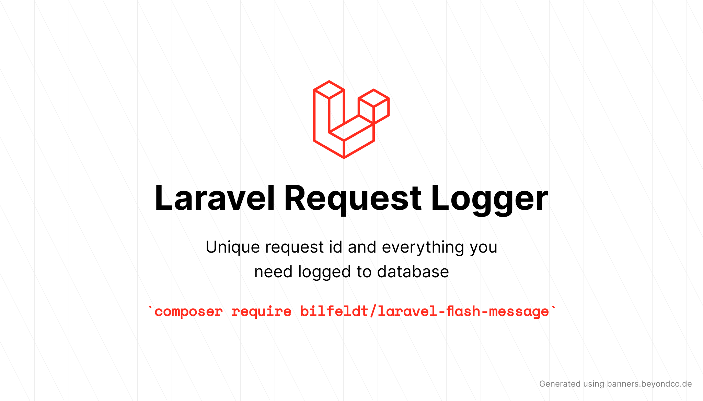

# Flexible and extendable logging of Laravel application request and responses



[](https://packagist.org/packages/bilfeldt/laravel-request-logger)
[](https://github.com/bilfeldt/laravel-request-logger/actions?query=workflow%3Arun-tests+branch%3Amain)
[](https://github.styleci.io/repos/424928370/shield)
[](https://packagist.org/packages/bilfeldt/laravel-request-logger)

Zero configuration logging of Requests and Responses to database or custom drivers in Laravel applications - no more issues debugging customer support requests.

| Version | Laravel     | PHP                              |
|---------|-------------|----------------------------------|
| 1.*     | 8.* \| 9.*  | 7.4.* \| 8.0.* \| 8.1.*          |
| 2.*     | 10.*        | 8.1.* \| 8.2.*                   |
| 3.*     | 10.*        | 8.1.* \| 8.2.* \| 8.3.* \| 8.4.* |

## Installation

You can install the package via composer:

```bash
composer require bilfeldt/laravel-request-logger
```

Publish and run the migrations with:

```bash
php artisan vendor:publish --provider="Bilfeldt\RequestLogger\RequestLoggerServiceProvider" --tag="request-logger-migrations"
php artisan migrate
```

You can publish the config file with:
```bash
php artisan vendor:publish --provider="Bilfeldt\RequestLogger\RequestLoggerServiceProvider" --tag="request-logger-config"
```

## Usage

It is possible to enable logging of all or some requests conditionally using one of the approaches below.

### Enable log via middleware (Recommended)

This package comes with a convenient `requestlog` middleware that can be used to enable logging of request by simply registering the middleware on the routes (or route groups) you wish to log:

```php
Route::middleware('requestlog')->get('/', function () {
    return 'Hello World';
});
```

### Enable via config file

The config file includes some convenient settings for enabling logging of all or some requests:

```php
// Enable all requests:
'log_methods' => ['*'],

// or enable all server errors
'log_statuses' => ['5**'],
```

### Enable log via request

This package adds a macro on the `Illuminate\Http\Request` class making it possible to enable logging directly from the request:

```php
/**
 * Index posts.
 *
 * @param  Request  $request
 * @return Response
 */
public function index(Request $request)
{
    $request->enableLog();

    //
}
```

## Extending with custom Drivers

This package implements the [Laravel Manager Class](https://inspector.dev/how-to-extend-laravel-with-driver-based-services/) making it possible to easily register custom drivers either in your application or by third party packages.

An `example` driver can be specified as middleware parameters:

```php
Route::middleware('log:example')->get('/', function () {
    return 'Hello World';
});
```

or via request macro:

```php
$request->enableLog('example');
```

## Pruning

The number of logged requests can quickly grow if you are not pruning the logs regularly. In order to keep the logs manageable, you can use the `prune` command to remove old logs as [described in the Laravel Docs](https://laravel.com/docs/8.x/eloquent#pruning-models):

```php
$schedule->command('requestlog:prune')->daily();
```

Note that the default `RequestLog` model setup by this package will not be discovered as a "Prunable" model by Laravel default `model:prune` command as it does not reside in the `app/Models` directory. If you change this class in the configuration to a custom class this will be auto registered and the command above will be needless.

## Notes and advises

### Proxies and load balancers

When using proxies and/or load balancers then the IP address of the proxy/load balancer must be listed as a [Trusted Proxy](https://laravel.com/docs/8.x/requests#configuring-trusted-proxies) for the users IP address to be correctly logged as the IP of the proxy itself will be logged otherwise.

## Testing

```bash
composer test
```

## Changelog

Please see [CHANGELOG](CHANGELOG.md) for more information on what has changed recently.

## Contributing

Please see [CONTRIBUTING](.github/CONTRIBUTING.md) for details.

## Security Vulnerabilities

Please review [our security policy](../../security/policy) on how to report security vulnerabilities.

## Credits

- [Anders Bilfeldt](https://github.com/bilfeldt)
- [Laravel Telescope](https://github.com/laravel/telescope/blob/master/src/Watchers/RequestWatcher.php): Collection of data from request/response is almost entirely taken from this package.
- [All Contributors](../../contributors)

## License

The MIT License (MIT). Please see [License File](LICENSE.md) for more information.
